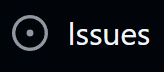

# Contributing to MyoAssist

We intend for MyoAssist to be a true community-driven project and look forward to accepting your contributions!

## Before you contribute

### Documentation and Community

Please read MyoAssist's documentation and look through current topics on our GitHub [discussions](https://github.com/neumovelab/myoassist/discussions) and [issues](https://github.com/neumovelab/myoassist/issues) pages.

## How to Contribute

We welcome contributions from the community. Here are the three main ways you can contribute:

### 1. GitHub Issues

Use Issues for:
- **Bug Reports**: Report issues you encounter
- **Feature Requests**: Suggest new features or improvements
- **Questions**: Ask for help or clarification
- **Documentation Issues**: Report problems with documentation

### Issue Labels

We use the following labels to organize issues:

- `bug`: Something isn't working
- `documentation`: Improvements or additions to documentation
- `enhancement`: New feature or request
- `help wanted`: Extra attention is needed
- `question`: Further information is requested

### 2. GitHub Discussions

Use Discussions for:
- **Community Help**: Get help from the community
- **General Questions**: Ask questions about MyoAssist usage
- **Sharing Experiences**: Share your experiences and use cases
- **Ideas Discussion**: Discuss potential features or improvements
- **Community Support**: Help other users with their questions

### 3. Pull Requests

Use Pull Requests for:
- **Code Contributions**: Submit code improvements and new features
- **Documentation Updates**: Improve or add documentation
- **Bug Fixes**: Submit fixes for reported issues
- **Example Code**: Add examples or tutorials

## Contributing Guidelines

### Reporting Bugs

How to submit a good bug report:

- Use a clear and descriptive title
- Make it easy to reproduce the problem. If this requires a model or specific setup, provide detailed steps
- Clearly state what is the expected behavior
- Include an illustrative screenshot or error message, if relevant
- **Use appropriate labels** when creating issues (e.g., `bug`, `documentation`, `enhancement`)

Try to provide context:

- Include your MyoAssist version and system information

**Note**: If you're unable to create a GitHub issue, please email us at
- [Model,Controller Optimization: robbins.cal@northeastern.edu](mailto:robbins.cal@northeastern.edu)
- [RL: son.hyo@northeastern.edu](mailto:son.hyo@northeastern.edu)
- [General: s.song@northeastern.edu](mailto:s.song@northeastern.edu)

### Suggesting Enhancements

Before submitting an enhancement suggestion:

- Check if you're using the [latest version](https://github.com/your-org/myoassist/releases/latest) of MyoAssist
- Perform a quick [search](https://github.com/your-org/myoassist/issues) to see if the enhancement has already been suggested. If it has, add a comment to the existing issue instead of opening a new one

How to submit a good enhancement suggestion:

- Use a clear and descriptive title
- Describe the current behaviour and the behavior which you hope to see instead
- Explain why this enhancement would be useful
- Specify the version of MyoAssist and platform/OS you are using
- **Use the `enhancement` label** when creating feature request issues

### Contributing Code

- Except for small and straightforward bugfixes, please get in touch with us before you start working on a contribution so that we can help and possibly guide you
- All submissions require review. Please use GitHub pull requests for this purpose
- Follow the existing code style and adequately comment your code
    - [PEP 8 - Style Guide for Python Code](https://peps.python.org/pep-0008/)
- Make small pull requests. We will likely ask you to split up a large pull request into self-contained, smaller ones

### Documentation Contributions

- Help improve our documentation by submitting pull requests
- Fix typos, clarify explanations, or add missing information
- Add examples or tutorials that would help other users
- Translate documentation to other languages if you're comfortable

## Community Guidelines

This project follows Google's [Open Source Community Guidelines](https://opensource.google/conduct/).

Once you have met all the requirements, your code will be merged. Thanks for improving MyoAssist! 
