# Available Devices

### Devices

<!-- Row 1 -->

    

        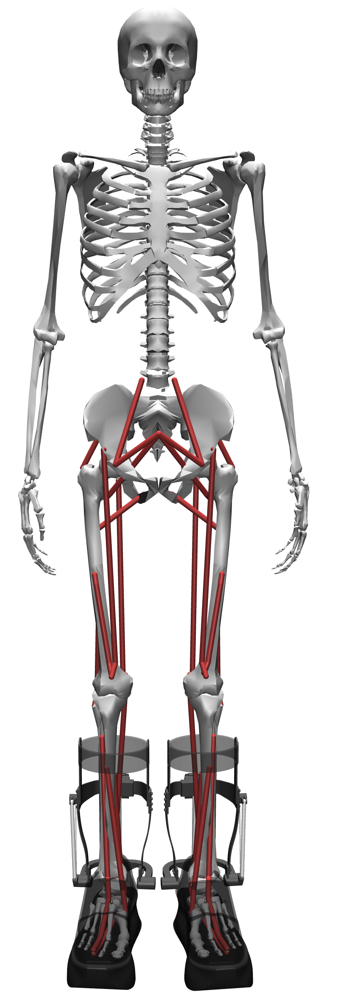
        
<strong><a href="#humotech-exo-010" style="text-decoration: none; color: inherit;">HUMOTECH</a></strong>

    

    

        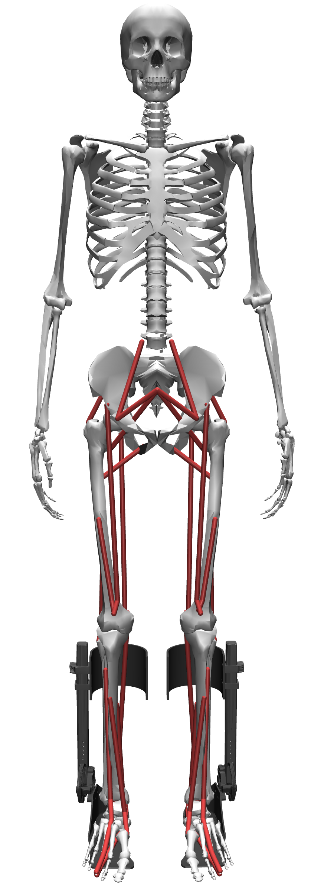
        
<strong><a href="#openexo-ankle-module" style="text-decoration: none; color: inherit;">OPENEXO</a></strong>

    

<!-- Row 2 -->

    

        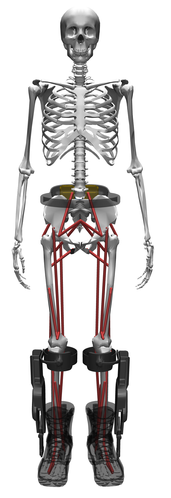
        
<strong><a href="#dephy-exoboots" style="text-decoration: none; color: inherit;">DEPHY</a></strong>

    

    

        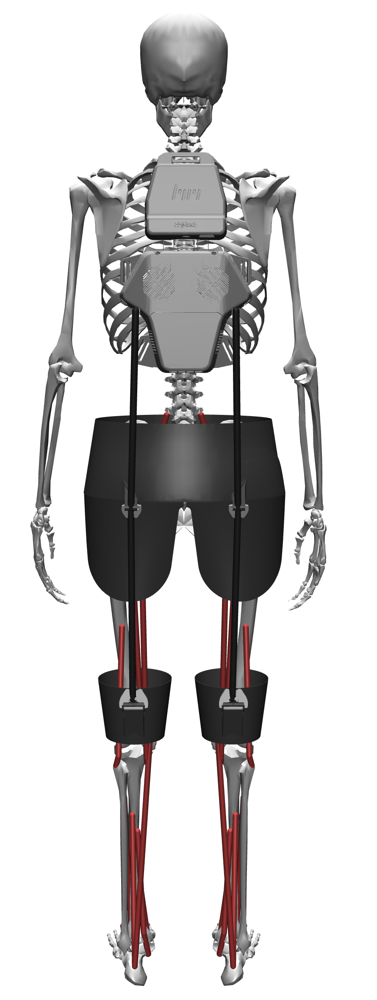
        
<strong><a href="#hurotics-h-medi" style="text-decoration: none; color: inherit;">HMEDI</a></strong>

    

<!-- Row 3 -->

    

        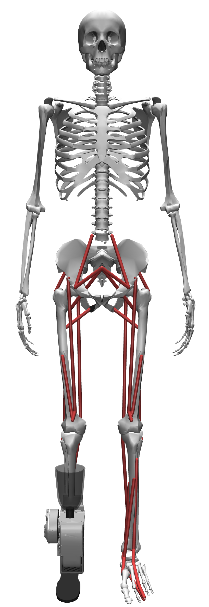
        
<strong><a href="#open-source-leg" style="text-decoration: none; color: inherit;">OSL Ankle</a></strong>

    

    

        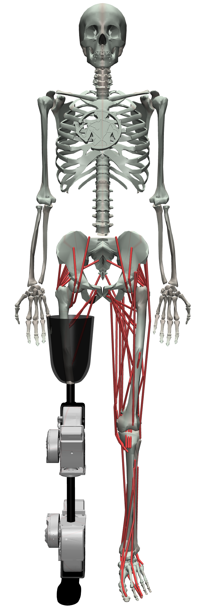
        
<strong><a href="#open-source-leg" style="text-decoration: none; color: inherit;">OSL Knee-Ankle</a></strong>

    

### Musculoskeletal Models

| Device Type | Model Type | Variant | File Name | Location | Description |
|-------------|------------|---------|-----------|----------|-------------|
| **BASELINE** | 22-muscle 2D | TUTORIAL | `myoLeg22_2D_TUTORIAL.xml` | `models/22muscle_2D/` | Tutorial model for learning purposes |
| | 22-muscle 2D | NO EXO | `myoLeg22_2D_BASELINE.xml` | `models/22muscle_2D/` | Basic 2D leg model without exoskeleton |
| | 26-muscle 3D | TUTORIAL | `myoLeg26_TUTORIAL.xml` | `models/26muscle_3D/` | 3D tutorial model |
| | 26-muscle 3D | NO EXO | `myoLeg26_BASELINE.xml` | `models/26muscle_3D/` | Basic 3D leg model without exoskeleton |
| **DEPHY** | 22-muscle 2D | DEPHY | `myoLeg22_2D_DEPHY.xml` | `models/22muscle_2D/` | Baseline with Dephy exoskeleton |
| | 26-muscle 3D | DEPHY | `myoLeg26_DEPHY.xml` | `models/26muscle_3D/` | 3D Baseline with Dephy exoskeleton |
| | 80-muscle 3D | DEPHY | `myolegs_DEPHY.xml` | `models/80muscle/myoLeg80_DEPHY/` | Full myoLegs model with Dephy exoskeleton |
| **HMEDI** | 22-muscle 2D | HMEDI | `myoLeg22_2D_HMEDI.xml` | `models/22muscle_2D/` | Baseline with HMEDI exoskeleton |
| | 26-muscle 3D | HMEDI | `myoLeg26_HMEDI.xml` | `models/26muscle_3D/` | 3D Baseline with HMEDI exoskeleton |
| | 80-muscle 3D | HMEDI | `myolegs_HMEDI.xml` | `models/80muscle/myoLeg80_HMEDI/` | Full myoLegs model with HMEDI exoskeleton |
| **HUMOTECH** | 22-muscle 2D | HUMOTECH | `myoLeg22_2D_HUMOTECH.xml` | `models/22muscle_2D/` | Baseline with Humotech exoskeleton |
| | 26-muscle 3D | HUMOTECH | `myoLeg26_HUMOTECH.xml` | `models/26muscle_3D/` | 3D Baseline with Humotech exoskeleton |
| | 80-muscle 3D | HUMOTECH | `myolegs_HUMOTECH.xml` | `models/80muscle/myoLeg80_HUMOTECH/` | Full myoLegs model with Humotech exoskeleton |
| **OPENEXO** | 22-muscle 2D | OPENEXO | `myoLeg22_2D_OPENEXO.xml` | `models/22muscle_2D/` | Baseline with OpenExo exoskeleton |
| | 26-muscle 3D | OPENEXO | `myoLeg26_OPENEXO.xml` | `models/26muscle_3D/` | 3D Baseline with OpenExo exoskeleton |
| | 80-muscle 3D | OPENEXO | `myolegs_OPENEXO.xml` | `models/80muscle/myoLeg80_OPENEXO/` | Full myoLegs model with OpenExo exoskeleton |
| **OSL** | 22-muscle 2D | OSL_A | `myoLeg22_2D_OSL_A.xml` | `models/22muscle_2D/` | Baseline with OSL ankle prosthetic |
| | 26-muscle 3D | OSL_A | `myoLeg26_OSL_A.xml` | `models/26muscle_3D/` | 3D Baseline with OSL ankle prosthetic |
| | 80-muscle 3D | OSL_KA | `myolegs_OSL_KA.xml` | `models/80muscle/myoLeg80_OSL_KA/` | Full myoLegs model with OSL knee-ankle prosthetic |

### Mesh Assets

| Asset Type | Location | Description |
|------------|----------|-------------|
| **Anatomical Meshes** | `models/mesh/` | Individual bone and joint STL files |
| **Exoskeleton Meshes** | `models/mesh/Dephy/` | Dephy exoskeleton components |
| | `models/mesh/HMEDI/` | HMEDI exoskeleton components |
| | `models/mesh/Humotech/` | Humotech exoskeleton components |
| | `models/mesh/OpenExo/` | Tutorial exoskeleton components |
| | `models/mesh/OSL/` | OSL ankle prosthetic components. Knee components in MyoSuite directory. |
| | `models/mesh/Tutorial/` | Tutorial exoskeleton components |

## Device Details

### Humotech EXO-010

    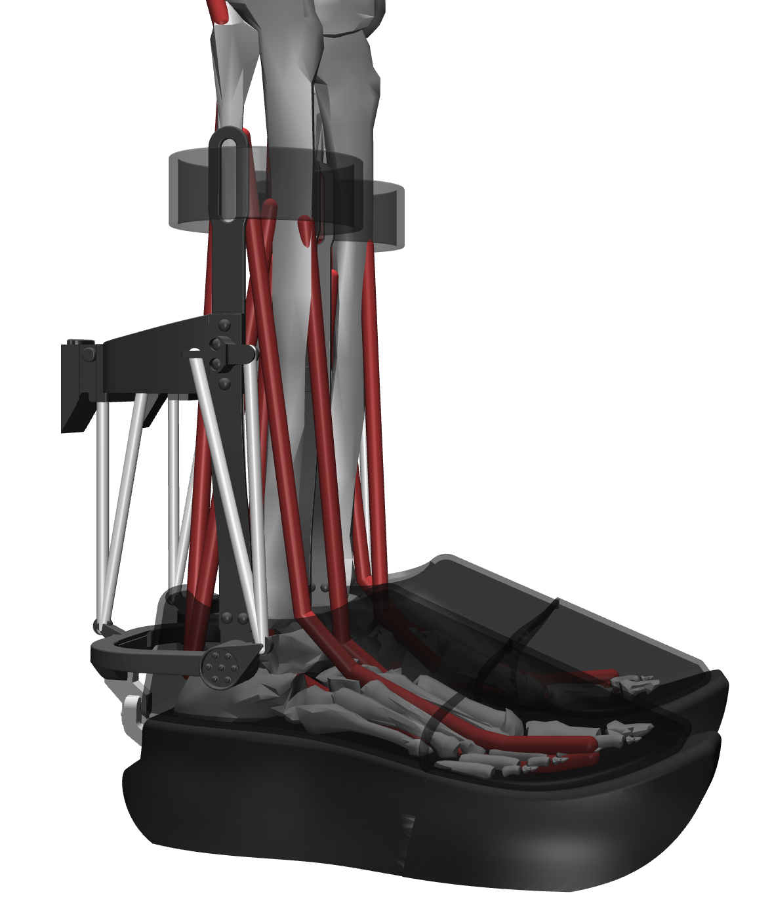
    

        
<strong>Type:</strong> Ankle exoskeleton emulator

        
<strong>Website:</strong> <a href="https://humotech.com/products/wearable-devices/" target="_blank">https://www.humotech.com</a>

        
<strong>Summary:</strong> The Humotech EXO-010 emulator system provides plantarflexion and dorsiflexion assistance through a cable-driven system. The adjustable design accommodates various shoe sizes (US Men's 5-12) and user heights. Features high torque output with force sensing and custom integrated footwear.

    

### OpenExo Ankle Module

    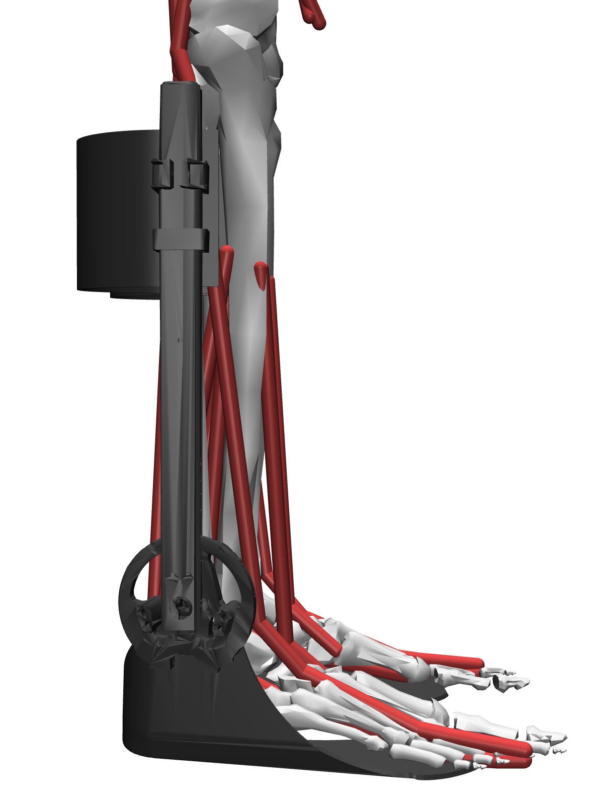
    

        
<strong>Type:</strong> Modular exoskeleton

        
<strong>Website:</strong> <a href="https://theopenexo.nau.edu/" target="_blank">https://www.openexo.org</a>

        
<strong>Summary:</strong> OpenExo is a modular, open-source exoskeleton designed for research and development by Professor Zach Lerner's Lab at Northern Arizona University. OpenExo's modular architecture enables researchers to adapt the system for diverse experimental applications while maintaining comprehensive lower limb support.

    

### Dephy ExoBoots

    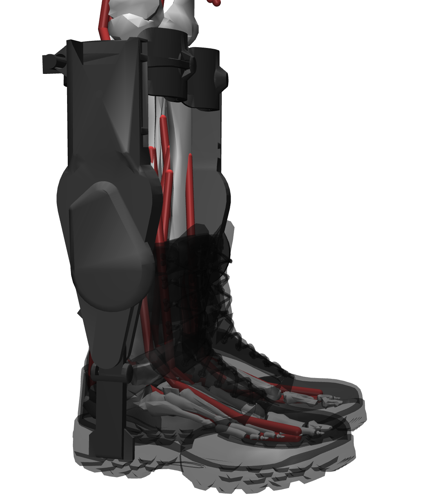
    

        
<strong>Type:</strong> Ankle exoskeleton

        
<strong>Website:</strong> <a href="https://www.dephy.com/" target="_blank">https://www.dephy.com</a>

        
<strong>Summary:</strong> Based on research from the MIT Media Lab, the Dephy ExoBoots are a versatile tool for both in the lab and outdoors, making them a great tool for both research institutions and broader applications.

    

### Hurotics H-MEDI

    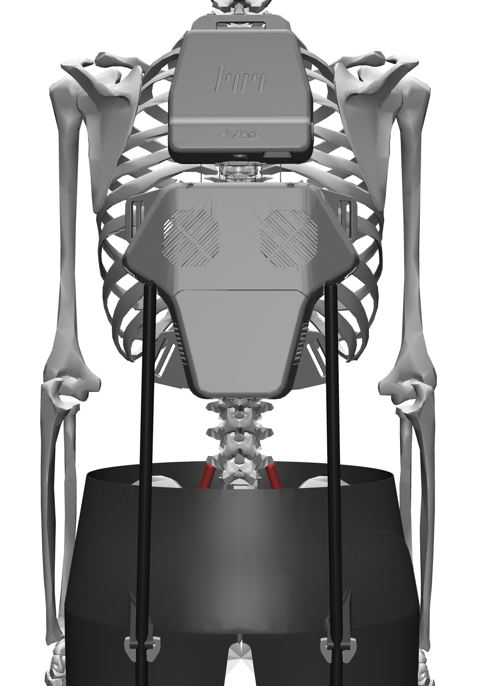
    

        
<strong>Type:</strong> Hip and knee assistance system

        
<strong>Website:</strong> <a href="https://www.hurotics.com/h-medi" target="_blank">https://www.hmedi.com</a>

        
<strong>Summary:</strong> The Hurotics H-Medi is a space-unrestricted, lightweight rehabilitation device that provides gait training capabilities without excess bulk. The H-Medi features real-time biometric analysis and professional monitoring capabilities for simultaneous gait improvement training and functional assessment.

    

### Open-Source Leg

    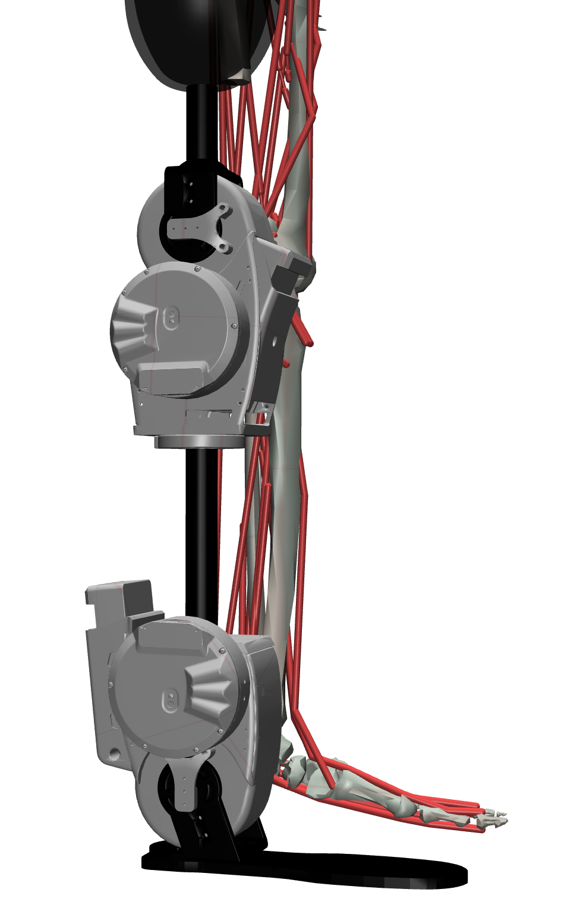
    

        
<strong>Type:</strong> Active prosthetic knee and/or ankle system

        
<strong>Website:</strong> <a href="https://opensourceleg.org/" target="_blank">https://www.osl-ankle.com</a>

        
<strong>Summary:</strong> The OSL is a low-cost, high-performance robotic knee and ankle system from the University of Michigan. This fully open-source prosthetic leg facilitates comparison between control strategies and accelerates prosthetic research development. Features active degrees of freedom in both joints with comprehensive sensing.

    

