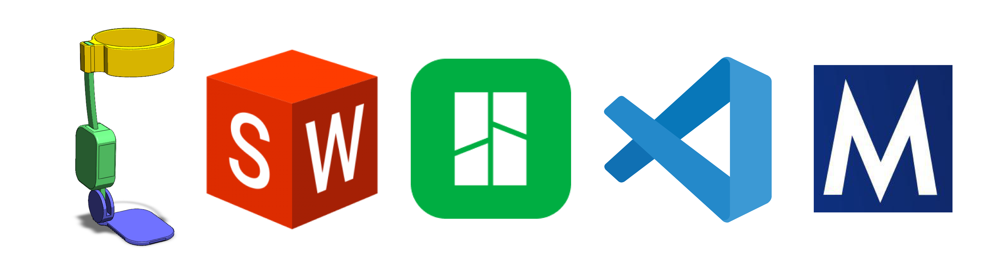
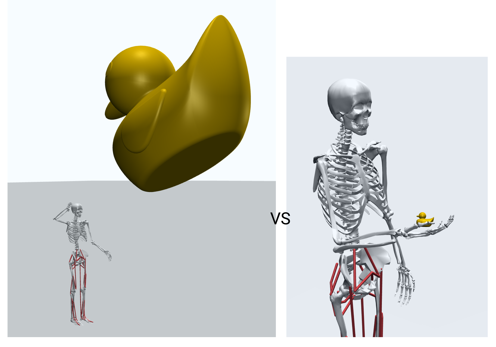
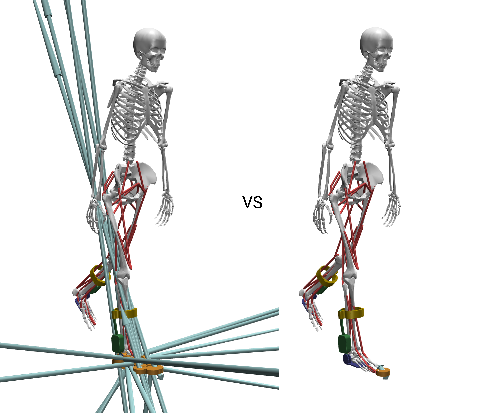

# Modeling Guide

This document provides a guide for researchers and developers on how to modify the base musculoskeletal model to integrate custom exoskeletons, prosthetics, or other wearable devices within the MyoAssist framework. For more details on the MuJoCo XML structure, please see the official [MuJoCo Documentation](https://mujoco.readthedocs.io/en/stable/XMLreference.html).

## 1. What You Will Need

Before you begin, ensure you have the following tools and resources:
- **3D Model of Your Device:** The device you intend to simulate.
- **CAD Software:** A CAD program of your choice (e.g., SolidWorks, Fusion 360, etc.).
- **(Optional) Slicer:** A slicer of your choice (e.g., Bambu Studio, PrusaSlicer, etc.)
- **XML Editor:** A text editor or IDE for modifying XML files (e.g., VS Code, Notepad++).
- **MuJoCo Visualizer:** The standalone MuJoCo simulator, which can be downloaded from the [MuJoCo GitHub releases](https://github.com/google-deepmind/mujoco/releases).

<div align="center">

</div>
<div align="center">
<i>Example programs and materials; not sponsored</i>
</div>

## 2. General Tips

### Simplify Your Meshes
To minimize the number of components you need to import, define, and position, it is recommended to group connected parts of your device that do not have a relative degree of freedom. When exporting your meshes, combine static components into a single `.stl` file to simplifies the model while maintaining accuracy.

### Check Your Reference Frames
Verifying the coordinate system and origin of your components in your CAD software before exporting them will save significant time later. While not strictly necessary, using a 3D printing slicer can be helpful for quick adjustments to your `.stl` files, though all essential changes can be made in your primary CAD software.

## 3. Scaling and Transforming Your Components

The MuJoCo models in this framework are built at a 1:1000 scale. If your device is modeled at life-size, you must scale it down to 1/1000th or 0.1%.

The MuJoCo world frame uses a **(+x forward, +y left, +z up)** coordinate system. However, due to the quaternion that rotates the model's root `pelvis` body, the subsequent musculoskeletal bodies operate in a rotated frame: **(+x forward, +y up, +z right)**. Thus, we have to account for this transformation and coordinate frame when exporting .stl files, and when positioning bodies later. Saving your .stl files positioned correctly in this frame will save significant time later (this is where slicers can make quick work of the necessary transformations). The figure below illustrates the difference: the life-sized rubber duck on the left is defined in the world frame, while the correctly scaled duck on the right is attached to the model's hand and oriented in the model's coordinate system. 

<div align="center">

</div>
<div align="center">
<i>Rubber duckie defined in the world frame at life-size vs. defined in the body frame at model-scale</i>
</div>

## 4. Loading Mesh Files

Once your `.stl` files are ready, you declare them in the `<asset>` section of your XML model file. Use the `<mesh>` tag to set the file path and assign a unique name to each component. It is important to maintain this naming convention when referencing these assets later in the file.

**Example (`myoLeg22_2D_TUTORIAL.xml`):**
```xml
<asset>
    ...
    <!-- Exoskeleton -->
    <mesh file="mesh/Tutorial/shin_cuff_r.stl" name="shin_cuff_r"/>
    <mesh file="mesh/Tutorial/actuator_r.stl" name="actuator_r"/>
    <mesh file="mesh/Tutorial/foot_attachment_r.stl" name="foot_attachment_r"/>
    ...
</asset>
```
For device components that appear identically more than once, a mesh import can be repeated and applied to two separate names:

**Example: Reusing a Mesh**
```xml
<asset>
    ...
    <!-- Exoskeleton -->
    <mesh file="mesh/Tutorial/shin_cuff.stl" name="shin_cuff_r"/>
    <mesh file="mesh/Tutorial/shin_cuff.stl" name="shin_cuff_l"/>
</asset>
```

## 5. Adding Device Bodies

### Modifying the Musculoskeletal Model for an Exoskeleton
Each component of your device can be added to the model's kinematic tree within the `<worldbody>` section. This requires careful consideration of how your device attaches to the body.

For basic visualization and inertial properties, you can simply nest the device's `<body>` element within the skeletal body it moves with. The position of each body is defined relative to its parent, and its inertial properties are defined relative to its own position.

Positioning can be a painstaking process of small adjustments. The best practice is to make a change, reload the model in the MuJoCo visualizer, and check the result. You can use `pos` for cartesian coordinates and `quat` or `euler` for orientation.

**Example (`myoLeg22_2D_TUTORIAL.xml`):**
Here, the actuator is added as a child of the `tibia_r` (right tibia) body.
```xml
...
<body name="tibia_r">
    ...
    <body name="actuator_r" pos="0 0 0">
        <inertial diaginertia="0 0 0" mass="0"/>
        <geom name="actuator_r" mesh="actuator_r_geom" type="mesh" rgba="1 1 1 1"/>
    </body>
</body>
```
If your device has its own internal joints or degrees of freedom you wish to constrain, you will need to create a more complex kinematic tree with nested bodies and additional `<joint>` definitions or other equalities (see [MuJoCo XML Reference](https://mujoco.readthedocs.io/en/stable/XMLreference.html#equality)).

### Modifying the Musculoskeletal Model for a Prosthesis
In the case of a prosthetic device, you will need to perform a "virtual amputation" on the base model or modify one of the two provided prosthetic models (one transtibial, one transfemoral, both right leg). This involves removing the biological limb segments and replacing them with your prosthetic device. The following steps use the `myoLeg26_OSL_A.xml` model as an example of a transtibial amputation.

**1. Remove and Replace Biological Bodies and Geoms:**
Delete the `<body>` elements of the limb segments you are replacing. For a right transtibial amputation, this includes the `tibia_r`, `talus_r`, `calcn_r`, and `toes_r` bodies. Be sure to remove all nested bodies, geoms, joints, and sites as well. For skeletal segments that are a different length or shape after amputation, a slicer or CAD software can be used to perform the cut at the desired length.

**2. Remove Associated Muscles and Tendons:**
In the `<tendon>` and `<actuator>` sections, remove all muscles that cross the amputated joint. For a transtibial amputation, this includes the right-side ankle muscles: `gastroc_r`, `soleus_r`, and `tibant_r`. For muscles that may have been rerouted during amputation, the muscle insertion points can be modified at the corresponding site.

**3. Attach the Prosthetic Device:**
Add the prosthetic components as new `<body>` elements, nested appropriately in the kinematic tree. For a transtibial prosthesis, the `tibia_r` body can be repurposed as the attachment point for the socket and pylon.

**Example (`myoLeg26_OSL_A.xml`):**
For this transtibial amputation, the `tibia_r` body is replaced with a cut geometry and the OSL prosthesis is added below.
```xml
<body name="tibia_r" pos="0 0 0">
    <geom mesh="osl_tibia_fibula_trans_r" name="osl_tibia_fibula_trans_r" rgba="1 1 1 1" type="mesh"/>
    ...
    <body name="osl_generic_socket" pos="0 -0.3 0.006">
        <geom name="osl_generic_socket" type="mesh" mesh="osl_generic_socket" condim="3" contype="1"/>

        <body name="osl_tibial_pylon" pos="0 0.05 0.006">
            ...
            <body name="osl_ankle_assembly" pos="0 -0.14 -0.006">
                ...
                <body name="osl_foot_assembly">
                    <joint name="osl_ankle_angle_r" pos="0 0 0" axis="0 0 1" range="-0.5236 0.5236"/>
                    ...
```

## 6. Defining Actuators

Powered devices require actuators, which are defined in the `<actuator>` section. The type of actuator you use will depend on your device's specifications (e.g., motors, cable-driven systems).

`general` actuators, as shown below, apply a force or torque directly to a specified `joint`. Other types, like `tendon` actuators, act on spatial tendons. The provided models contain various examples: the HMEDI model uses tendons to simulate a cable-driven system, while the OSL model defines more specific motor properties.

**Example (`myoLeg22_2D_TUTORIAL.xml`):**
These `general` actuators apply assistive torque to the biological ankle joints.
```xml
<actuator>
    ...
    <!-- Biological Muscle Actuators -->
    ...
    <general biastype="none" gaintype="fixed" dyntype="none" joint="ankle_angle_r" name="Exo_R" gear="100.0" ctrlrange="-1 1" ctrllimited="true"/>
    <general biastype="none" gaintype="fixed" dyntype="none" joint="ankle_angle_l" name="Exo_L" gear="100.0" ctrlrange="-1 1" ctrllimited="true"/>
</actuator>
```

## 7. Sensors and Contact Points

It is critical to verify how your model interacts with its environment. The `Contact Point` and `Contact Force` visualizations in the MuJoCo viewer are used for this.

For each keyframe pose, check for reasonable contact points and forces.
- **Self-contact:** If the model collides with itself, you may need to add `<pair>` elements to the `<contact>` section to exclude collisions between specific geoms.
- **Unexpected forces and contacts:** If the model generates surprising forces or contacts, try adjusting the pose (`qpos` vector in `<keyframe>`). The image below (left) shows an example of pelvis_ty being set too low, resulting in excessive contacts and forces between the musculoskeletal model and the terrain geometry.
- **Initial velocity:** For walking keyframes (`walk_left`, `walk_right`), you can set an initial forward velocity for the `pelvis_tx` joint in the `qvel` vector to give the model a starting "kick."

When adding devices to the feet (e.g., shoes), you must update the model's initial height (`pelvis_ty` position) to prevent it from starting inside the terrain geometry. You must also reposition the contact sites (`r_foot_touch`, `r_toes_touch`) to account for the new geometry.

<div align="center">

</div>
<div align="center">
<i>Incorrect contacts and forces vs. corrected contacts and forces</i>
</div>

## 8. Using the MuJoCo Visualizer

The visualizer is your primary tool for inspecting and debugging your model.

**Important:** When loading or reloading a model, you **must** reset it to a keyframe pose via the `Simulation -> Key` menu. The initial pose when loading a model is *always* incorrect.

### Key Menus
The **Joint** panel on the right of the visualizer allow you to interactively pose the model and see the corresponding `qpos` values, which is helpful for finding new or tuning keyframe positions. The **Control** panel allows you to adjust muscle or other actuator control values and (if the simulation is *not* paused, assess the resulting behavior of the model. The **Simulation** and **Rendering** sections provide the most useful options.

#### Simulation Menu
- **Reset:** Resets the model to a selected keyframe pose.
- **Reload:** Fully reloads the XML file to reflect any saved changes.
- **Run/Pause:** Toggles the physics simulation. It should typically be paused when editing.
- **Copy Pose:** Copies the current `qpos` and `qvel` vectors to the clipboard, which is useful for updating keyframes after posing the model.

#### Rendering Menu
- **Inertia:** Renders the inertial "bounding box" for every body.
- **Contact Point / Contact Force:** Visualizes contact locations and forces, as described above.
- **Center of Mass:** Renders the model's calculated center of mass.
- **Static Body:** Hides or shows non-moving bodies like the ground plane.
- **Tendon:** Hides or shows muscle and actuator tendons.
- **Group Enable:** This section lets you toggle the visibility of different geom groups defined in the XML. Most notably, the foot and toe touch sensor sites are in `Site groups -> "Site 3"`, and you can toggle this group to check their positions.

### Visualizer Hotkeys and Shortcuts

The MuJoCo visualizer provides several keyboard and mouse shortcuts for navigation and control:

#### Basic Controls
- **Space**: Play/Pause simulation
- **+/-**: Speed Up/Down
- **Left/Right Arrow**: Step Back/Forward
- **Tab/Shift-Tab**: Toggle Left/Right UI
- **[ ]**: Cycle camera
- **Esc**: Free camera
- **F1**: Help
- **F2**: Info
- **F3**: Profiler
- **F4**: Sensors
- **F5**: Full screen

#### Mouse Controls
- **Scroll, middle drag**: Zoom
- **Left drag**: View Orbit
- **Double-click**: Select
- **Page Up**: Select parent
- **Right double-click**: Center camera on mouse location
- **[Shift] right drag**: View Pan
- **Ctrl [Shift] drag**: Object Rotate
- **Ctrl [Shift] right drag**: Object Translate

#### Additional Features
- **UI right-button hold**: Show shortcuts
- **UI title double-click**: Expand/collapse all