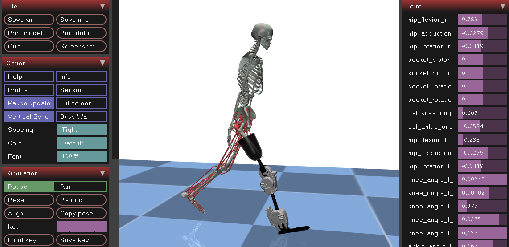
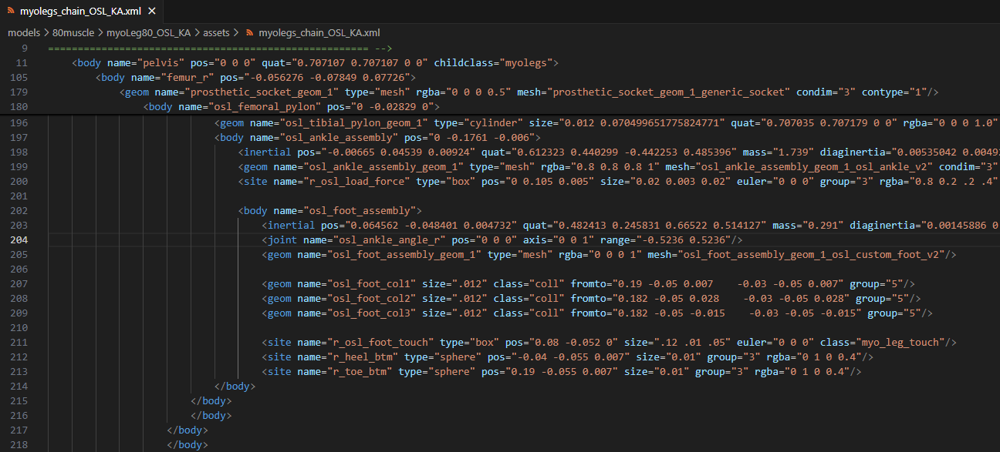

# Musculoskeletal Modeling

This section covers the modeling aspects of MyoAssist, including available models and model preparation.

  

    
  

  

    
  

## [Available Models](Available_Models)
Overview of the pre-configured musculoskeletal models included with MyoAssist:
- 22-muscle 2D models for rapid prototyping
- 26-muscle 3D models for detailed analysis
- Pre-configured variants for different assistive devices

## [Modeling Guide](Modeling)
Technical documentation for model development:
- Model and mesh file preparation
- XML file structure and components
- Adding devices to models
- Configuring actuators and sensors
- Tips for using the MuJoCo visualizer

## [Model Preparation](model_prep)
Step-by-step guide for preparing and modifying models:
- Setting up the simulation environment
- Importing and scaling models
- Configuring contact properties
- Validating model behavior