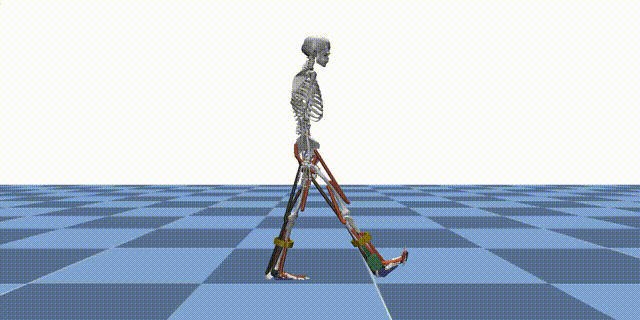
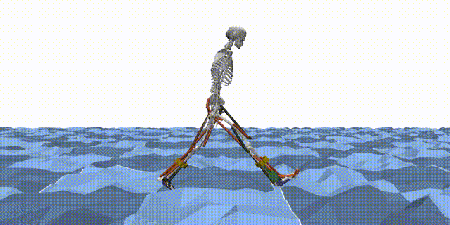
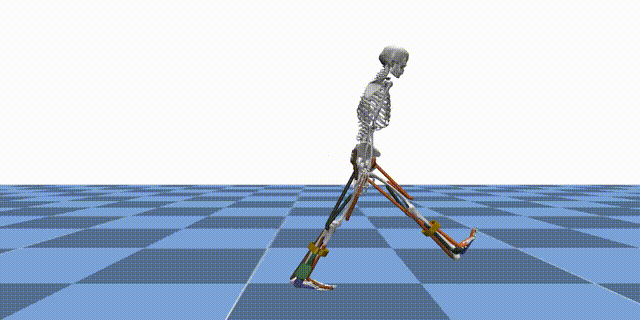
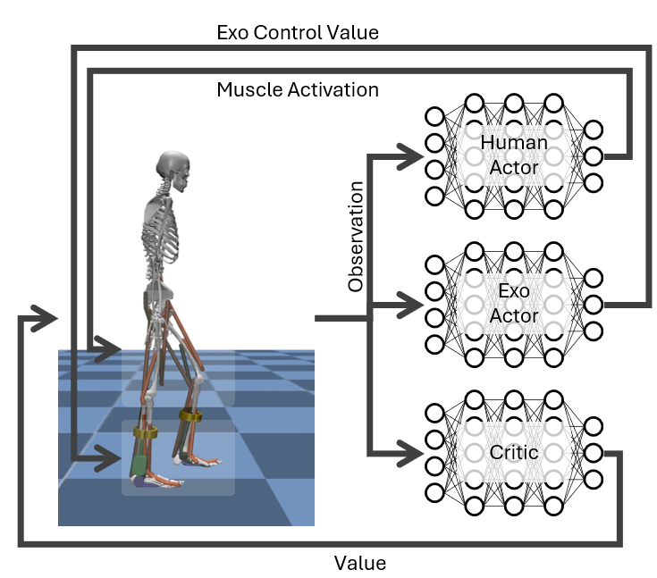
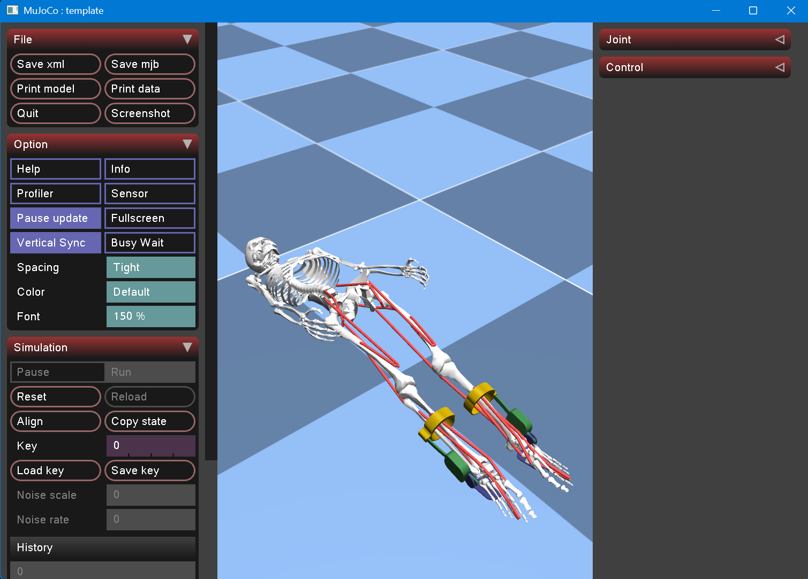
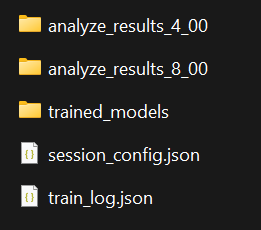
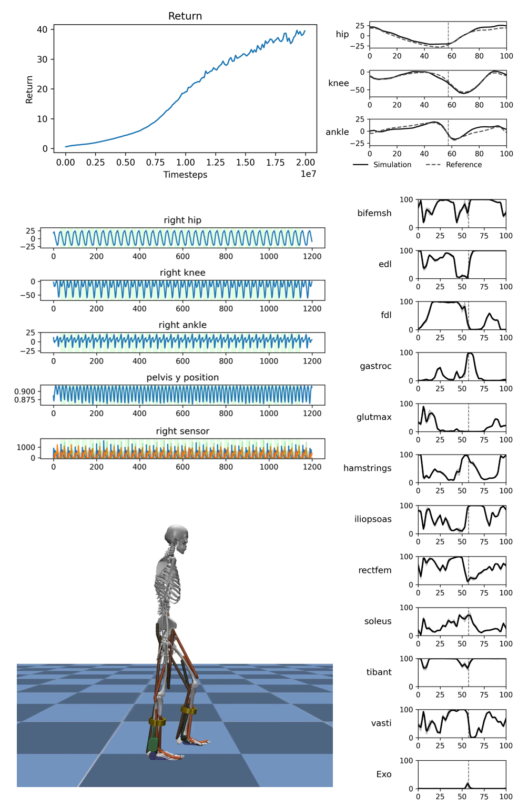
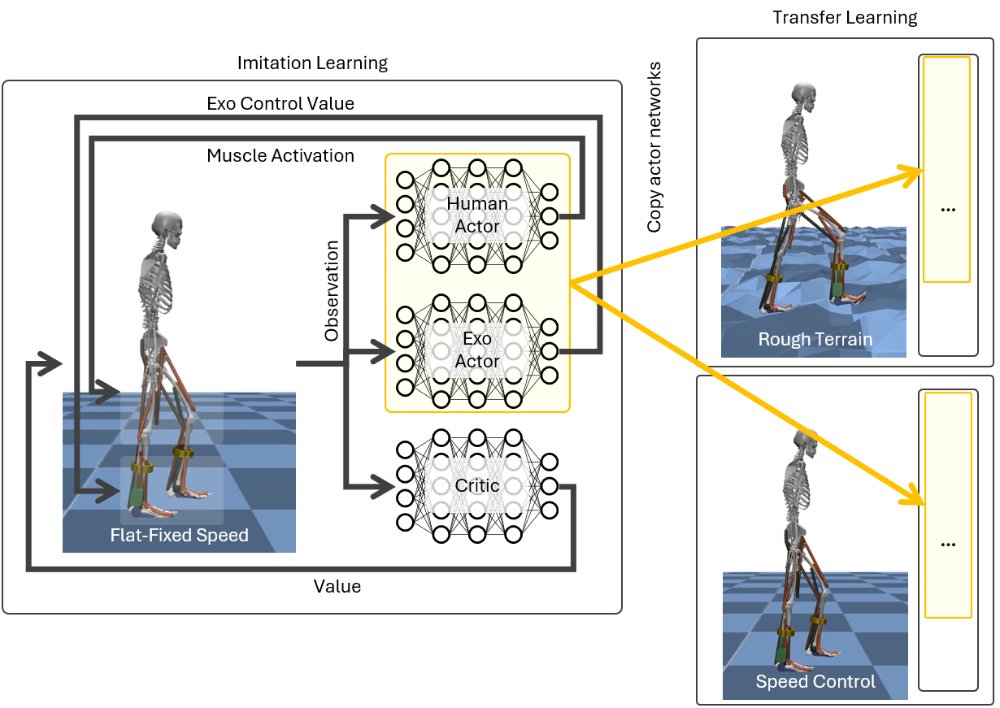
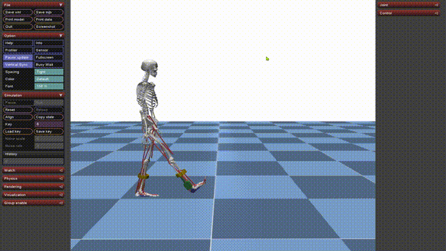
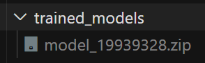

# Reinforcement Learning

MyoAssist’s reinforcement learning (RL) pipeline is built on top of **[Stable-Baselines3 (SB3) PPO](https://stable-baselines3.readthedocs.io/en/master/index.html)** and a set of custom **[MuJoCo](https://mujoco.org/)** environments that simulate human–exoskeleton interaction. This page gives you a bird’s-eye view of how everything fits together and where to find more information.

<div style="display: flex; justify-content: center; align-items: center; gap: 24px;">
  <div style="flex: 1; text-align: center;">
    
    <!-- <div>Flat Terrain</div> -->
  </div>
  <div style="flex: 1; text-align: center;">
    
    <!-- <div>Rough Terrain</div> -->
  </div>
  <div style="flex: 1; text-align: center;">
    
    <!-- <div>Rough Terrain</div> -->
  </div>
</div>


Reinforcement learning (RL) is a machine learning paradigm where an agent learns to make decisions by interacting with an environment and receiving feedback in the form of rewards. In the context of MyoAssist, RL is used to train control policies for human–exoskeleton systems within MuJoCo simulation environments.

<p align="center">
  
</p>

**Observation Space:**  
In our environments, the agent receives observations that include:
- Joint angles
- Joint velocities
- Muscle activations
- Sensory data (such as ground contact, force sensors, etc.)
- etc

**Action Space:**  
The agent outputs actions that control:
- Muscle activations (for the human actor network)
- Exoskeleton control values (for the exoskeleton actor network)


---


<!-- ## Core Building Blocks

| Layer | File / Doc | Description |
|-------|------------|-------------|
| **Environment** | [`envs/`](../../rl_train/envs/) · [Getting Started](getting_started.md) | MuJoCo-based Gym environments that expose observations, rewards and actions. |
| **Trainer** | [`run_train.py`](../../rl_train/run_train.py) · [Code Structure](code_structure.md) | Loads a JSON config, constructs vectorised envs and launches SB3 PPO. |
| **Callback** | [`learning_callback.py`](../../rl_train/utils/learning_callback.py) | Handles logging, checkpoints, videos and curriculum switches. |
| **Analyzer** | [`analyzer/`](../../rl_train/analyzer/) · [Network Index Handler](network-index-handler.md) | Post-hoc evaluation: plots, gait metrics and network indexing analysis. |
| **Configuration** | [`train_configs/*.json`](../../rl_train/train/train_configs/) · [Configuration Guide](configuration.md) | Fully define terrain, reward weights, network indexing and SB3 hyper-parameters. | -->

---

## Training Workflow

1. **Define a config** – start from an existing JSON preset or create one from scratch.
2. **Launch training**
   ```bash
   python rl_train/run_train.py --config_file_path rl_train/train_configs/my_config.json
   ```
3. **Monitor progress** – logs & results in `results/train_session_*`.
4. **Evaluate policy** –
   ```bash
   python rl_train/run_policy_eval.py results/train_session_<timestamp>
   ```
5. **Analyze results** – automatic plots + gait metrics saved under `analyze_results/`.

---

## Key Features

- **Multi-Actor Support** – Separate networks for human muscles and exoskeleton actuators (see [Network Index Handler](network-index-handler)).
- **Terrain Curriculum** – Train on a progression of terrains from flat to rough ([Terrain Types](terrain-types)).
- **Reference Motion Imitation** – Optional imitation reward using ground-truth gait trajectories.
- **Realtime Evaluation** – Run policies in realtime with `--flag_realtime_evaluate`.

---


# Getting Started

This guide shows you the fastest way to test the RL system and run training in the MyoAssist RL system.

## RL Training Entry Points

Here is a quick overview of the main entry point scripts in the [`rl_train`](https://github.com/neumovelab/myoassist/tree/main/rl_train/) folder:

| File | Purpose |
|------|---------|
| [`run_sim_minimal.py`](https://github.com/neumovelab/myoassist/blob/main/rl_train/run_sim_minimal.py) | The simplest way to create and test a MyoAssist RL environment. No training, just environment creation and random actions. |
| [`run_train.py`](https://github.com/neumovelab/myoassist/blob/main/rl_train/run_train.py) | Main entry point for running RL training sessions. Loads configuration, sets up environments, and starts training. |
| [`run_policy_eval.py`](https://github.com/neumovelab/myoassist/blob/main/rl_train/run_policy_eval.py) | Entry point for evaluating and analyzing trained policies. Useful for testing policy performance and generating analysis results. |


## Quick Test Commands

### 1. Environment Creation Example

See how to create a simulation environment and run for 150 frames(5sec):

```bash
python rl_train/run_sim_minimal.py
```

- mac:
```bash
mjpython rl_train/run_sim_minimal.py
```
> **Note:**
If you need MuJoCo visualizer in mac os, simply use `mjpython` instead of `python` to run your script.  
You do not need to install anything extra—just change the command:

> **Note:**  
If you see the error message `ModuleNotFoundError: No module named 'flatten_dict'`, simply run the command again. This will usually resolve the problem automatically.


<!-- -->

<p align="center">
  
</p>


**What this does:**
- Shows an example of creating a Gym wrapped MuJoCo simulation environment
- No actual training - just environment creation example

### 2. Quick Training Test

Run a minimal training session to verify everything works:
```bash
python rl_train/run_train.py --config_file_path rl_train/train/train_configs/test.json --flag_rendering
```
<!-- ```bash
python rl_train/run_train.py --config_file_path rl_train/train/train_configs/imitation_tutorial_22_separated_net_partial_obs.json --config.total_timesteps 12 --config.env_params.num_envs 1 --config.ppo_params.n_steps 4 --config.ppo_params.batch_size 4 --config.logger_params.logging_frequency 1 --config.logger_params.evaluate_frequency 1 --flag_rendering
``` -->

**What this does:**
- Runs actual reinforcement learning training
- Training for only 12 timesteps (very fast)
- Uses 1 environment (minimal resource usage)
- Enables rendering to see the simulation
- Logs results after every rollout (4 steps) for immediate feedback

### 3. Check Results

After training, check the results folder:

```bash
# Results location
rl_train/results/train_session_[date-time]/
```
<!--  -->
<p align="center">
  
</p>

**What you'll find:**
- `analyze_results_[timesteps]_[evaluate_number]`: Training analysis results
- `session_config.json`: Configuration used for this training
- `train_log.json`: Training log data
- `trained_models/`: Trained models(`.zip`) saved at each log interval - can be used for evaluation or transfer learning

## Full Training (When Ready)

Once you've verified everything works, run full training:

- windows:
```bash
python rl_train/run_train.py --config_file_path rl_train/train/train_configs/imitation_tutorial_22_separated_net_partial_obs.json
```

- mac:
```bash
mjpython rl_train/run_train.py --config_file_path rl_train/train/train_configs/imitation_tutorial_22_separated_net_partial_obs.json
```

This file is the default example configuration we provide.  
For more details, see the [Understanding Configuration](./configuration.html) section.


## Policy Evaluation

Test a trained model:

```bash
python rl_train/run_policy_eval.py [path/to/trainsession/folder]
```

**Example (evaluating with a pretrained model we provide):**
```bash
python rl_train/run_policy_eval.py docs/assets/tutorial_rl_models/train_session_20250728-161129_tutorial_partial_obs
```


After training, an `analyze_results` folder will be created inside your `train_session` directory.  
This folder contains various plots and videos that visualize your agent's performance.

- **Where to find:**  
  ```
  rl_train/results/train_session_[date-time]/analyze_results/
  ```
- **What's inside:**  
  - Multiple plots (e.g., reward curves, kinematics, etc.)
  - Videos
  <p align="center">
    
  </p>


The parameters used for evaluation and analysis (such as which plots/videos are generated) are controlled by the `evaluate_param_list` in your `session_config.json` file.

For more details on how to customize these parameters, see the [Understanding Configuration](./configuration.html) section.


## Transfer Learning


```bash
python rl_train/run_train.py --config_file_path [path/to/transfer_learning/config.json] --config.env_params.prev_trained_policy_path [path/to/pretrained_model]
```

or you can specify the `env_params.prev_trained_policy_path` in config(.json) file

> **Note:** The `[path/to/pretrained_model]` should point to a `.zip` file, but do not include the `.zip` extension in the path.


## Realtime Policy Running
You can run a trained policy in realtime simulation:
<!--  -->
<p align="center">
  
</p>

- windows:
```bash
python rl_train/run_train.py --config_file_path [path/to/config.json] --config.env_params.prev_trained_policy_path [path/to/model_file] --flag_realtime_evaluate
```

- mac:
```bash
mjpython rl_train/run_train.py --config_file_path [path/to/config.json] --config.env_params.prev_trained_policy_path [path/to/model_file] --flag_realtime_evaluate
```


**Parameters:**
- `[path/to/config.json]`: Path to the JSON file in the train_session folder
- `[path/to/model_file]`: Path to the model file (.zip) without extension. It is located in the train_models folder
<!--  -->
<p align="center">
  
</p>

**Example (evaluating with a pretrained model we provide):**
- windows:
```bash
python rl_train/run_train.py --config_file_path docs/assets/tutorial_rl_models/train_session_20250728-161129_tutorial_partial_obs/session_config.json --config.env_params.prev_trained_policy_path docs/assets/tutorial_rl_models/train_session_20250728-161129_tutorial_partial_obs/trained_models/model_19939328 --flag_realtime_evaluate
```
- mac:
```bash
mjpython rl_train/run_train.py --config_file_path docs/assets/tutorial_rl_models/train_session_20250728-161129_tutorial_partial_obs/session_config.json --config.env_params.prev_trained_policy_path docs/assets/tutorial_rl_models/train_session_20250728-161129_tutorial_partial_obs/trained_models/model_19939328 --flag_realtime_evaluate
```
