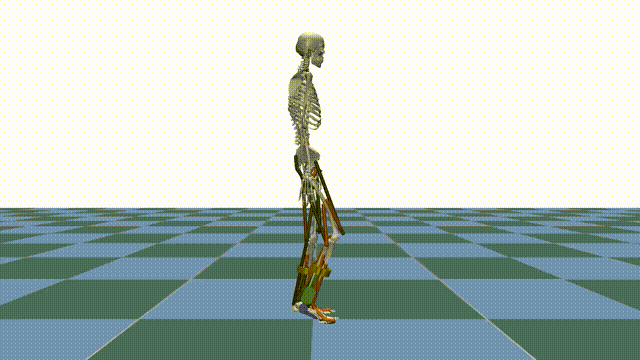

# Reinforcement Learning

MyoAssist’s reinforcement learning (RL) pipeline is built on top of **Stable-Baselines3 (SB3) PPO** and a set of custom MuJoCo environments that simulate human–exoskeleton interaction. This page gives you a bird’s-eye view of how everything fits together and where to find more information.

<div style="display: flex; justify-content: center; align-items: center; gap: 24px;">
  <div style="flex: 1; text-align: center;">
    
    <!-- <div>Flat Terrain</div> -->
  </div>
  <div style="flex: 1; text-align: center;">
    
    <!-- <div>Rough Terrain</div> -->
  </div>
</div>

---


<!-- ## Core Building Blocks

| Layer | File / Doc | Description |
|-------|------------|-------------|
| **Environment** | [`envs/`](../../rl_train/envs/) · [Getting Started](getting_started.md) | MuJoCo-based Gym environments that expose observations, rewards and actions. |
| **Trainer** | [`run_train.py`](../../rl_train/run_train.py) · [Code Structure](code_structure.md) | Loads a JSON config, constructs vectorised envs and launches SB3 PPO. |
| **Callback** | [`learning_callback.py`](../../rl_train/utils/learning_callback.py) | Handles logging, checkpoints, videos and curriculum switches. |
| **Analyzer** | [`analyzer/`](../../rl_train/analyzer/) · [Network Index Handler](network-index-handler.md) | Post-hoc evaluation: plots, gait metrics and network indexing analysis. |
| **Configuration** | [`train_configs/*.json`](../../rl_train/train/train_configs/) · [Configuration Guide](configuration.md) | Fully define terrain, reward weights, network indexing and SB3 hyper-parameters. | -->

---

## Training Workflow

1. **Define a config** – start from an existing JSON preset or create one from scratch.
2. **Launch training**
   ```bash
   python rl_train/run_train.py --config_file_path rl_train/train_configs/my_config.json
   ```
3. **Monitor progress** – logs & results in `results/train_session_*`.
4. **Evaluate policy** –
   ```bash
   python rl_train/run_policy_eval.py results/train_session_<timestamp>
   ```
5. **Analyze results** – automatic plots + gait metrics saved under `analyze_results/`.

---

## Key Features

- **Multi-Actor Support** – Separate networks for human muscles and exoskeleton actuators (see [Network Index Handler](network-index-handler.md)).
- **Terrain Curriculum** – Train on a progression of terrains from flat to rough ([Terrain Types](terrain-types.md)).
- **Reference Motion Imitation** – Optional imitation reward using ground-truth gait trajectories.
- **Realtime Evaluation** – Run policies in realtime with `--flag_realtime_evaluate`.

---
