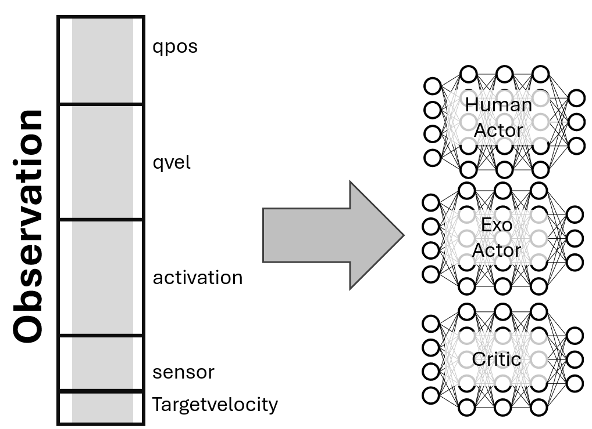
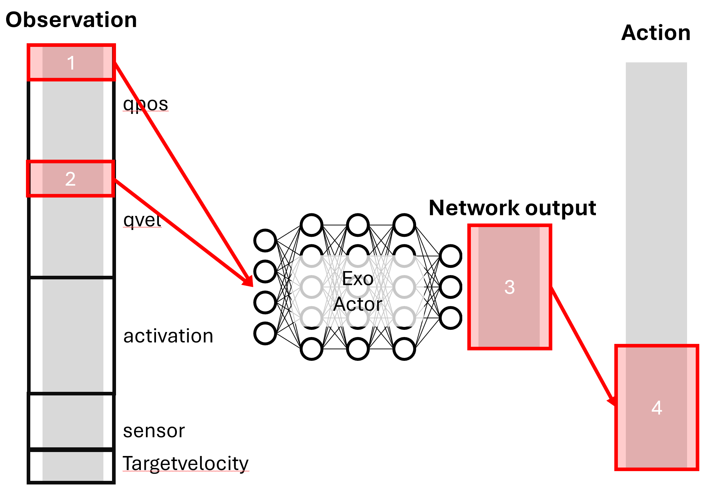

# Network Index Handler

The Network Index Handler enables selective observation input and targeted action output mapping for different networks in multi-actor reinforcement learning systems. This system allows specific networks to receive only relevant parts of the full observation and maps their outputs to specific indices in the action space.

## Overview

Network Indexing is essential when working with:

- **Selective Observation Input**: Networks that need only specific parts of the full observation
- **Targeted Action Mapping**: Networks whose outputs should be mapped to specific action indices
- **Multi-Actor Coordination**: Different actors controlling different parts of the action space

<p align="center">
  
</p>

> **Note:**  
The order of the observation vector can be checked in the `DEFAULT_OBS_KEYS` of the gym environment.([/rl_train/envs/](/rl_train/envs/))
Within this, the order of `qpos` (joint position), `qvel` (joint velocity), and joint/sensor keys can be found in the configuration file (e.g., `observation_joint_pos_keys`, `observation_joint_vel_keys`, `observation_joint_sensor_keys`).  
Each observation component is concatenated, so you can determine the index of each element in the full observation vector.  
The number of activations corresponds to the number of muscles.


## Core Concepts

### Observation Indexing

**Purpose**: Extract specific observation ranges for individual networks

**When to Use**:
- Different networks require different observation components
- Reducing input complexity for specialized networks
- Sharing observation data efficiently between networks

**Example**:
```json
{
  "type": "range", 
  "range": [0, 8], 
  "comment": "Extract joint position data for this network"
}
```

### Action Mapping

**Purpose**: Map network outputs to specific action space indices

**When to Use**:
- Network controls only specific action components
- Multiple networks contribute to different parts of the action space
- Coordinating human and exoskeleton actions

**Example**:
```json
{
  "type": "range_mapping",
  "range_net": [0, 11], 
  "range_action": [0, 11], 
  "comment": "Map network output to right leg muscle actions"
}
```

## Multi-Actor Architecture

### Human Actor Network

**Purpose**: Controls human muscle activations

**Observation**: 
- Receives comprehensive state information
- Processes full observation for coordinated muscle control

**Action**:
- Outputs muscle activation commands
- Maps to muscle action indices in the action space

### Exo Actor Network

**Purpose**: Controls exoskeleton assistance

**Observation**:
- Receives only essential information (e.g., ankle data)
- Uses minimal observation for focused control

**Action**:
- Outputs exoskeleton assistance commands
- Maps to exoskeleton action indices in the action space

### Common Critic Network

**Purpose**: Evaluates overall system performance

**Observation**:
- Receives full state information
- Evaluates complete system state

**Action**:
- No action output (critic only)
- Focuses on state evaluation

## Configuration Structure

The network indexing configuration follows this structure:

```json
"net_indexing_info": {
  "human_actor": {
    "observation": [...],
    "action": [...]
  },
  "exo_actor": {
    "observation": [...],
    "action": [...]
  },
  "common_critic": {
    "observation": [...]
  }
}
```

### Actor Networks

Actor networks require both observation and action indexing because they map observations to actions. Each actor network outputs actions based on its own observation subset.

**Example Actor Configuration**:
```json
"human_actor": {
  "observation": [
    {
      "type": "range",
      "range": [0, 8],
      "comment": "Joint position data"
    },
    {
      "type": "range", 
      "range": [8, 16],
      "comment": "Joint velocity data"
    }
  ],
  "action": [
    {
      "type": "range_mapping",
      "range_net": [0, 11],
      "range_action": [0, 11],
      "comment": "Right leg muscles"
    },
    {
      "type": "range_mapping",
      "range_net": [11, 22],
      "range_action": [11, 22],
      "comment": "Left leg muscles"
    }
  ]
}
```

### Critic Networks

Critic networks only predict a single value (the value function) and do not output actions. Therefore, they require only observation indexing to specify which parts of the state they evaluate.

**Example Critic Configuration**:
```json
"common_critic": {
  "observation": [
    {
      "type": "range",
      "range": [0, 50],
      "comment": "Full state evaluation"
    }
  ]
}
```

## Indexing Types

### Range Indexing

**Type**: `"range"`

**Purpose**: Extract specific observation ranges from the full state

**Use Cases**:
- Providing different networks with different observation components
- Reducing input complexity for specialized networks
- Efficient data sharing between networks

**Parameters**:
- `range`: `[start(inclusive), end(exclusive)]` - Inclusive range of indices to extract
- `comment`: Description of the extracted data

**Example**:
```json
{
  "type": "range",
  "range": [0, 2],
  "comment": "Ankle angle data"
}
```

### Range Mapping

**Type**: `"range_mapping"`

**Purpose**: Map network output ranges to specific action space indices

**Use Cases**:
- Coordinating multiple networks in the action space
- Ensuring each network controls specific action components
- Preventing conflicts between different actors

**Parameters**:
- `range_net`: `[start(inclusive), end(exclusive)]` - Network output range
- `range_action`: `[start(inclusive), end(exclusive)]` - Action space range to map to
- `comment`: Description of the action mapping

**Example**:
```json
{
  "type": "range_mapping",
  "range_net": [0, 2],
  "range_action": [22, 24],
  "comment": "Exoskeleton left and right actuators"
}
```

## Example

Here's a complete example of exoskeleton actor indexing:

**Configuration File**: `imitation_tutorial_22_separated_net_partial_obs.json`
<p align="center">
  
</p>

```json
"exo_actor": {
  "observation": [
    {
      "type": "range",
      "range": [0, 2],
      "comment": "2 ankle angles in 8 qpos without lumbar_extension"
    },
    {
      "type": "range",
      "range": [8, 10],
      "comment": "2 ankle angular velocities in 9 qvel without lumbar_extension"
    }
  ],
  "action": [
    {
      "type": "range_mapping",
      "range_net": [0, 2],
      "range_action": [22, 24],
      "comment": "2 actuators for exoskeleton left and right"
    }
  ]
}
```


