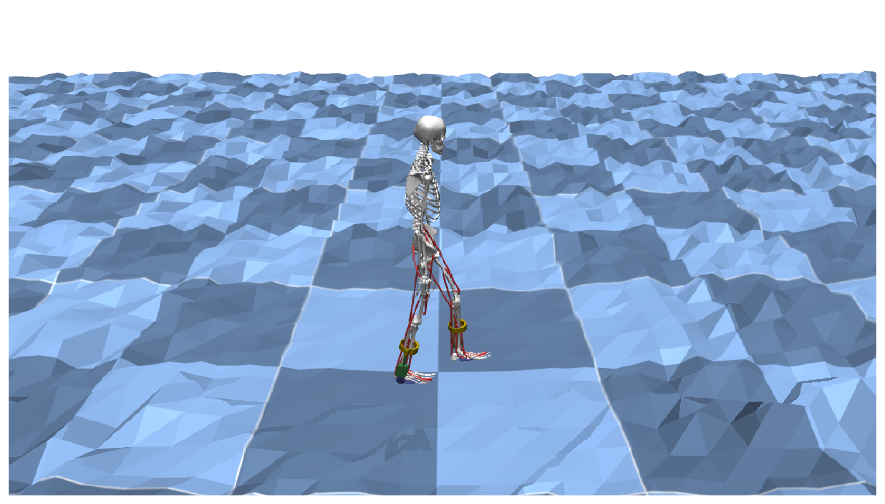
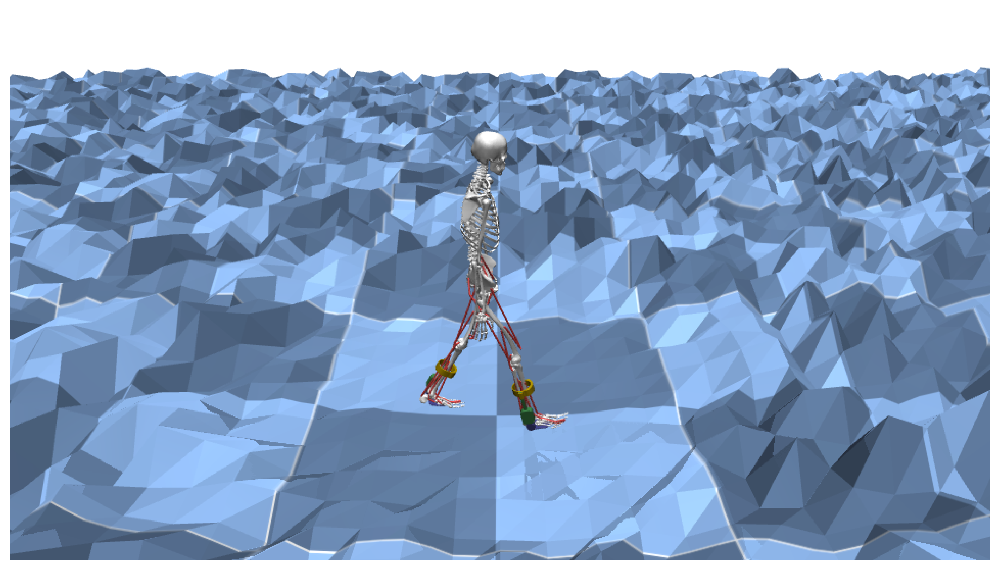
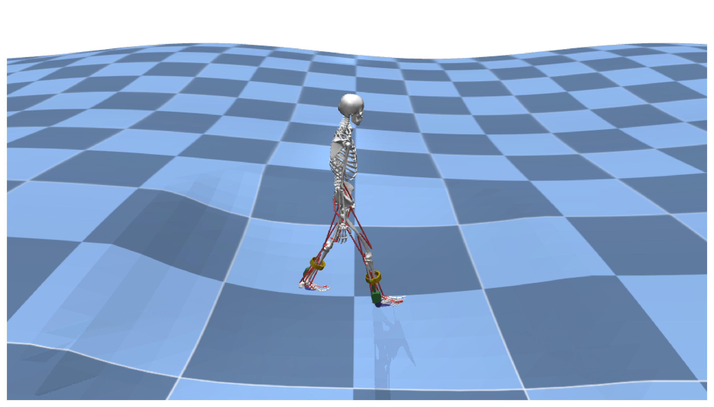
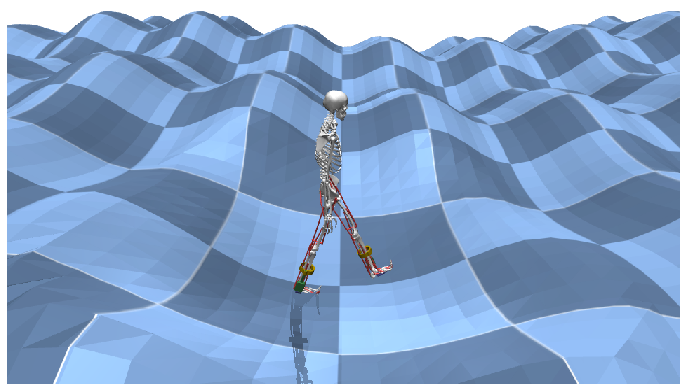
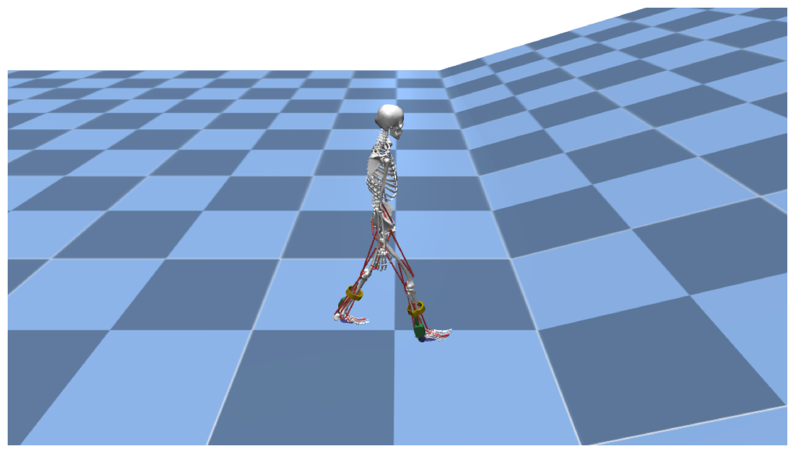
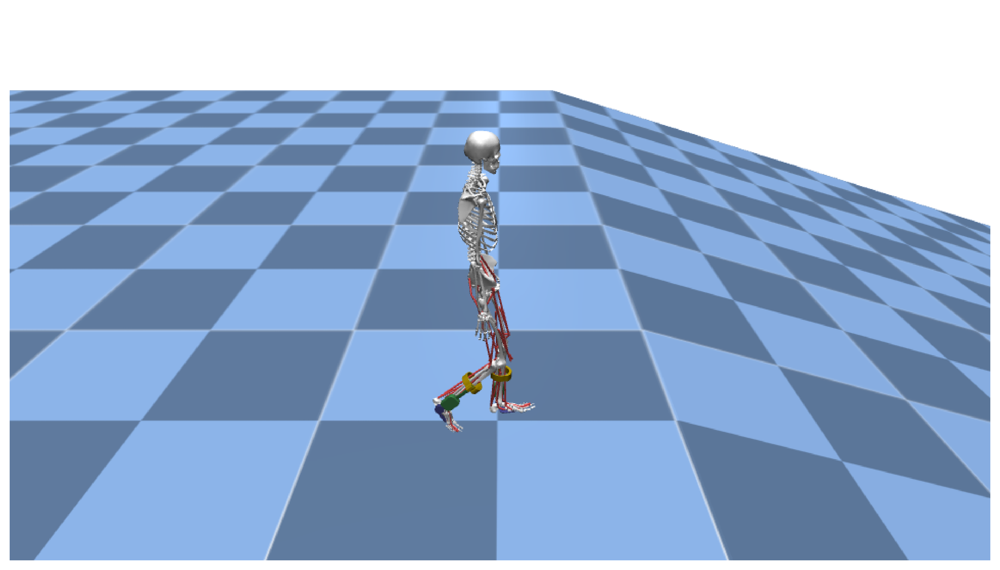

# Terrain Types

MyoAssist supports various terrain types for heightfield generation using the [HfieldManager](https://github.com/neumovelab/myoassist/blob/myoassist0.1prepare/myoassist_utils/hfield_manager.py).

## Available Terrain Types

| Type | Description | Parameters | Use Case |
|------|-------------|------------|----------|
| `flat` | Flat terrain | No parameters required | Basic training and evaluation |
| `random` | Random height variations | `amplitude` - Maximum height variation | Terrain adaptation training |
| `harmonic_sinusoidal` | Harmonic sinusoidal waves | `amplitude_row period_row amplitude_col period_col` | Complex terrain simulation |
| `slope` | Inclined slope | `slope_angle` - Slope angle in degrees | Slope walking training |

## Terrain Parameters

Parameters are space-separated values passed as strings:

```bash
# Random terrain with amplitude 0.1
terrain_params: "0.1"

# Harmonic sinusoidal with multiple waves
terrain_params: "0.2 20 0.1 8"

# Slope with 30% degree angle
terrain_params: "0.3"
```

## Detailed Terrain Descriptions

### Flat Terrain

**Type**: `flat`

**Description**: Creates a completely flat ground surface with no height variations.

**Parameters**: None required

**Use Case**: 
- Basic training scenarios
- Evaluation and testing
- Imitation learning baseline

**Example**:
```json
{
  "terrain_type": "flat",
  "terrain_params": ""
}
```

### Random Terrain
<p align="center">
  
  
</p>

**Type**: `random`

**Description**: Creates terrain with random height variations across the surface.

**Parameters**: 
- `amplitude` - Maximum height variation in meters

**Example**:
```json
{
  "terrain_type": "random",
  "terrain_params": "0.1"
}
```


### Harmonic Sinusoidal Terrain
<p align="center">
  
  
</p>

**Type**: `harmonic_sinusoidal`

**Description**: Creates terrain with harmonic sinusoidal waves in both row and column directions.

**Parameters**: 
- `amplitude_row` - Amplitude of row-direction waves
- `period_row` - Period of row-direction waves
- `amplitude_col` - Amplitude of column-direction waves  
- `period_col` - Period of column-direction waves

You can continue to add more sets of these four parameters (`amplitude_row`, `period_row`, `amplitude_col`, `period_col`) to create additional sinusoidal components in the terrain.

**Example**:
```json
{
  "terrain_type": "harmonic_sinusoidal",
  "terrain_params": "0.2 20 0.1 8"
}
```


### Slope Terrain
<p align="center">
  
  
</p>

**Type**: `slope`

**Description**: Creates an inclined slope starting from a center point.

**Parameters**:
- `slope_angle` - Slope angle as a ratio (tan value)

**Example**:
```json
{
  "terrain_type": "slope",
  "terrain_params": "0.3"
}
```


## Safe Zone

All terrain types include a safe zone around the starting position where terrain variations are minimized to prevent immediate falls or contact penation during training.

## Implementation Details

Terrain generation is handled by the [HfieldManager](https://github.com/neumovelab/myoassist/blob/myoassist0.1prepare/myoassist_utils/hfield_manager.py) class which:

